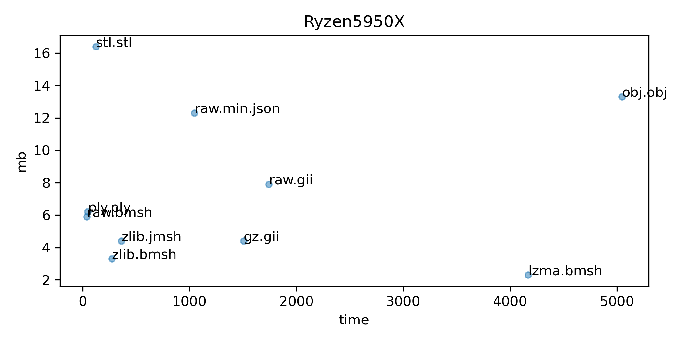

## About

This is a simple evaluation of different mesh formats used in neuroimaging. Feel free to suggest changes to optimize performance. JavaScript demonstrates a lot of speed variability. To mitigate this, each format is converted 10 times, with the time for the first run omitted.

A few notes on the formats:
 1. [GIfTI](https://www.nitrc.org/projects/gifti/) uses `GZipBase64Binary` with the optimal `RowMajorOrder`.
 2. [mz3](https://github.com/neurolabusc/surf-ice/tree/master/mz3) tested as both GZip compressed and raw formats.
 3. [OBJ](https://brainder.org/tag/wavefront-obj/) is an ASCII format, so a choice must be made regarding file size and precision.
 4. [STL](http://paulbourke.net/dataformats/stl/) format does not re-use vertices. The resulting mesh will appear faceted and use more GPU resources unless one applies a computationally expensive operation to weld vertices.
 5. [jmsh](https://en.wikipedia.org/wiki/JMesh) is a JSON-based general purpose geometry/mesh-data container based on the [JMesh](https://github.com/NeuroJSON/jmesh/blob/master/JMesh_specification.md) and [JData](https://github.com/NeuroJSON/jdata/blob/master/JData_specification.md) specifications; it is human-readable and widely parsable
 6. [bmsh](https://en.wikipedia.org/wiki/JMesh) is a binary-JSON ([BJData - Draft 2](https://github.com/NeuroJSON/bjdata/blob/Draft_2/Binary_JData_Specification.md)) based mesh-data container based on the JMesh specification; both `.bmsh` and `.jmsh` support data-level compression
 7. [json](http://json.org) is a minimized plain JSON file using [JMesh](https://github.com/NeuroJSON/jmesh/blob/master/JMesh_specification.md) annotations without compression
 8. [PLY](https://en.wikipedia.org/wiki/PLY_(file_format)) is a classic and elegant format that includes a text header and either binary or text data. It can store non-triangular meshes. This flexibility comes with a penalty in terms of speed and file size. 
 
The plots below show performance on a AMD Ryzen 5950X running Ubuntu 21.10. 



## Compiling

This is a simple node.js function that you can replicate on your own computer:

```
git clone https://github.com/neurolabusc/MeshFormatsJS
cd MeshFormatsJS/
npm install fflate gifti-reader-js atob pako buffer lzma-purejs bjd numjs
node ./meshtest.js

obj.obj Size 13307997 Time 5046
gz.gii Size 4384750 Time 1507
raw.gii Size 7866016 Time 1742
ply.ply Size 6226140 Time 50
gz.mz3 Size 3259141 Time 256
raw.mz3 Size 5898280 Time 16
stl.stl Size 16384084 Time 124
zlib.jmsh Size 4405604 Time 364
zlib.bmsh Size 3259049 Time 273
raw.min.json Size 12325881 Time 1047
raw.bmsh Size 5898902 Time 39
lzma.bmsh Size 2295259 Time 4168
```

## JavaScript, Python and Matlab

The `python` and `matlab` folders allow you to evaluate the performance of different languages. Be aware that the implementations vary between some of the source code, so one should be wary of making strong conclusions. Here are the performance times for each of these languages on a desktop Ryzen 5950X computer. The formats are ranked by file size. Ideally, one wants smale files that open quickly. A natural trade off is the uncompressed files are larger but are read more quickly. Note that all meshes are read from a local disk, whereas if data had to be downloaded the larger files would be relatively slower depending on internet bandwidth:

| Format       | Size | JS   | Python | Matlab |
|--------------|------|------|--------|--------|
| lzma.bmsh    | 2.3  | 4168 |        | 1041   |
| zlib.bmsh    | 3.3  | 273  | 136    | 228    |
| gz.mz3       | 3.3  | 256  | 177    | 291    |
| gz.gii       | 4.4  | 1507 | 211    | 403    |
| zlib.jmsh    | 4.4  | 364  | 190    | 470    |
| raw.mz3      | 5.9  | 16   | 4      | 35     |
| raw.bmsh     | 5.9  | 39   | 6633   | 86     |
| ply.ply      | 6.2  | 50   | 645    | 3030   |
| raw.gii      | 7.9  | 1742 | 141    | 410    |
| raw.min.json | 12.3 | 1047 | 253    | 2330   |
| obj.obj      | 13.3 | 5046 | 7333   | 3740   |
| stl.stl      | 16.4 | 124  | 130    | 1128   |

